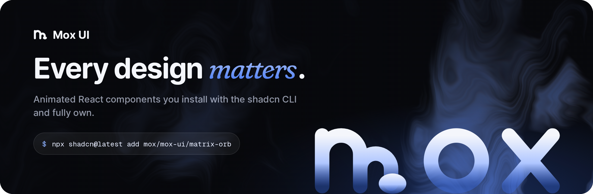

<div align="center">
  <a href="https://mox-ui.vercel.app">
    
  </a>

<br />
<br />

**Animated React components you install with the shadcn CLI and fully own.**


[**Website**](https://mox-ui.vercel.app) &nbsp;&middot;&nbsp; [Components](https://mox-ui.vercel.app/components) &nbsp;&middot;&nbsp; [llms.txt](https://mox-ui.vercel.app/llms.txt) &nbsp;&middot;&nbsp; [Contributing](CONTRIBUTING.md)

</div>

<br />

Mox UI is a free, open-source registry of animated React components. There is no package to depend on: each install copies the source into your project, so you can read it, restyle it and change it like your own code.

- **Built to feel good.** Every interaction is tuned with springs, easing and timing that make the interface feel alive.
- **Accessible motion.** Interactive components honor `prefers-reduced-motion`.
- **One command.** The shadcn CLI adds the component and installs its dependencies.
- **Ready for AI tools.** Every component has a copyable install command, and the full list is at [`/llms.txt`](https://mox-ui.vercel.app/llms.txt) for Claude, Codex, v0, Cursor and other assistants.

## Quick start

You need a React project with Tailwind CSS v4 and shadcn set up. If you don't have one yet, run `npx shadcn@latest init` first.

Add any component by its name:

```bash
npx shadcn@latest add mox/mox-ui/animated-counter
```

The same command with other package managers:

```bash
pnpm dlx shadcn@latest add mox/mox-ui/animated-counter
yarn dlx shadcn@latest add mox/mox-ui/animated-counter
bunx --bun shadcn@latest add mox/mox-ui/animated-counter
```

Keep `@latest` in the command. Installing from a GitHub registry needs shadcn 4.16 or newer, and without the tag your package runner may pick up an older local copy.

The component lands in `components/ui`, ready to import:

```tsx
"use client";

import { AnimatedCounter } from "@/components/ui/animated-counter";

export function Revenue({ total }: { total: number }) {
  return <AnimatedCounter value={total} className="text-6xl font-medium" />;
}
```

Every component page on the [website](https://mox-ui.vercel.app/components) has a live preview, the full props table and a usage example.

## Components

### Display

| Component                                                                        | What it is                                                                                                            | Install name           |
| -------------------------------------------------------------------------------- | --------------------------------------------------------------------------------------------------------------------- | ---------------------- |
| [SaaS template](https://mox-ui.vercel.app/components/saastemplate)               | A dark landing page template with a navbar, a hero, and a product screenshot.                                         | `saas-template`        |
| [Contribution skyline](https://mox-ui.vercel.app/components/contributionskyline) | A contribution calendar with a heatmap and an interactive 3D skyline.                                                 | `contribution-skyline` |
| [Folder component](https://mox-ui.vercel.app/components/foldercomponent)         | An animated folder whose cards fan out on hover and lift open on click, with a 3D-tilted flap.                        | `folder-component`     |
| [Code block](https://mox-ui.vercel.app/components/codeblock)                     | A clean code block that builds its entire theme from a single accent color.                                           | `code-block`           |
| [Gravity letters](https://mox-ui.vercel.app/components/gravityletters)           | A playful gravity field where letters, numbers, emoji, or any components you pass fall and pile up like real objects. | `gravity-letters`      |
| [GitHub activity](https://mox-ui.vercel.app/components/githubactivity)           | A contribution heatmap with a footer panel that expands over the grid to rank your top repositories.                  | `github-activity`      |
| [Step player](https://mox-ui.vercel.app/components/stepplayer)                   | An iOS-style stepped progress track with a play, pause and replay control.                                            | `step-player`          |
| [Animated counter](https://mox-ui.vercel.app/components/animatedcounter)         | A number that counts to its new value on a wheel of digits, like an odometer.                                         | `animated-counter`     |

### AI kit

| Component                                                      | What it is                                                                           | Install name  |
| -------------------------------------------------------------- | ------------------------------------------------------------------------------------ | ------------- |
| [Fluid orb](https://mox-ui.vercel.app/components/fluidorb)     | An animated WebGL orb with drifting fluid shading, inspired by ChatGPT's voice mode. | `fluid-orb`   |
| [Grid reveal](https://mox-ui.vercel.app/components/gridreveal) | A loading state for AI images that turns into the real picture when it arrives.      | `grid-reveal` |
| [Matrix orb](https://mox-ui.vercel.app/components/matrixorb)   | A dot-matrix orb that animates through idle, listening and thinking states.          | `matrix-orb`  |

### Navigation

| Component                                                                       | What it is                                                                                                         | Install name        |
| ------------------------------------------------------------------------------- | ------------------------------------------------------------------------------------------------------------------ | ------------------- |
| [Bounce sidebar](https://mox-ui.vercel.app/components/bouncesidebar)            | A vertical navigation list with a bouncy, spring-animated active indicator.                                        | `bounce-sidebar`    |
| [Hook sidebar](https://mox-ui.vercel.app/components/hooksidebar)                | A vertical navigation list with a dashed rail that marks the active item.                                          | `hook-sidebar`      |
| [Proximity sidebar](https://mox-ui.vercel.app/components/proximitysidebar)      | An interactive sidebar with proximity hover effects that appears while scrolling and responds to scroll intensity. | `proximity-sidebar` |
| [Scroll progress](https://mox-ui.vercel.app/components/scrollprogressindicator) | A scroll progress pill that expands into a squircle menu of sections you can jump to.                              | `scroll-progress`   |
| [Gooey nav](https://mox-ui.vercel.app/components/gooeynav)                      | A gooey navigation bar that separates the selected item from the group.                                            | `gooey-nav`         |

### Inputs

| Component                                                              | What it is                                                                                           | Install name      |
| ---------------------------------------------------------------------- | ---------------------------------------------------------------------------------------------------- | ----------------- |
| [Duration picker](https://mox-ui.vercel.app/components/durationpicker) | A gooey, spring-animated picker for entering a duration in hours and minutes.                        | `duration-picker` |
| [OTP input](https://mox-ui.vercel.app/components/otpinput)             | A one-time-code input whose characters roll into place behind a caret that slides from slot to slot. | `otp-input`       |
| [Delete button](https://mox-ui.vercel.app/components/deletebutton)     | A delete button that asks for confirmation in place, no dialog needed.                               | `delete-button`   |

### Feedback

| Component                                                                  | What it is                                                                                                           | Install name        |
| -------------------------------------------------------------------------- | -------------------------------------------------------------------------------------------------------------------- | ------------------- |
| [Emoji reaction](https://mox-ui.vercel.app/components/emojireaction)       | A tapback-style reaction button that opens a bar of Apple emoji and sends copies of your pick floating up out of it. | `emoji-reaction`    |
| [Notification bell](https://mox-ui.vercel.app/components/notificationbell) | An iOS-style notification bell with an unread count badge.                                                           | `notification-bell` |

## Run the site locally

This repo is the registry and the docs site in one Next.js app. It uses pnpm and Node.js 20.9 or newer.

```bash
git clone https://github.com/Moxsahil/mox-ui.git
cd mox-ui
pnpm install
pnpm dev
```

Open [localhost:3000](http://localhost:3000) to see the site.

| Script                | What it does                                                     |
| --------------------- | ---------------------------------------------------------------- |
| `pnpm dev`            | Starts the docs site in development mode.                        |
| `pnpm build`          | Builds the registry, then the site.                              |
| `pnpm registry:build` | Rebuilds `public/r/*.json` from `registry.json`.                 |
| `pnpm lint`           | Runs ESLint.                                                     |
| `pnpm typecheck`      | Generates route types and runs the TypeScript compiler.          |
| `pnpm format`         | Formats the repo with Prettier. `pnpm format:check` only checks. |

### Where things live

| Path                | Contents                                                                        |
| ------------------- | ------------------------------------------------------------------------------- |
| `components/ui/`    | The components that ship in the registry.                                       |
| `registry.json`     | The registry manifest: each component's files and dependencies.                 |
| `public/r/`         | The built registry the shadcn CLI installs from. Generated, don't edit by hand. |
| `lib/components.ts` | The docs for each component: description, interaction, props and usage.         |
| `app/`              | The docs site.                                                                  |

After changing anything in `components/ui` or `registry.json`, run `pnpm registry:build` so the installable files stay in sync.

## Contributing

Issues and pull requests are welcome. [CONTRIBUTING.md](CONTRIBUTING.md) walks through adding a component, from the first file to a working install command. [CONVENTIONS.md](CONVENTIONS.md) covers how component code and docs are written.

CI checks every pull request for formatting, types, lint errors and a clean build. A pre-commit hook lints and formats staged files for you.

Found a bug? [Open an issue](https://github.com/Moxsahil/mox-ui/issues).

## Credits

Mox UI began as a fork of [MOX UI](https://github.com/Moxsahil/mox-ui) by
[@Mox_sahil01](https://x.com/Mox_sahil01), and is MIT licensed under the terms of that
original work. The component code is inherited from it; the Mox UI name, logo and site
design are separate.

## License

[MIT](LICENSE). Use it in personal and commercial projects.

<div align="center">
  <br />
  <a href="https://mox-ui.vercel.app">
    
  </a>
  <p><sub>Every design matters.</sub></p>
</div>
